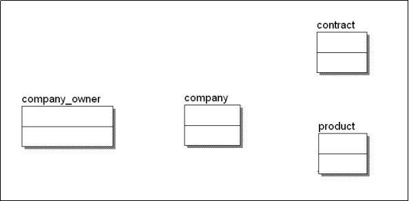
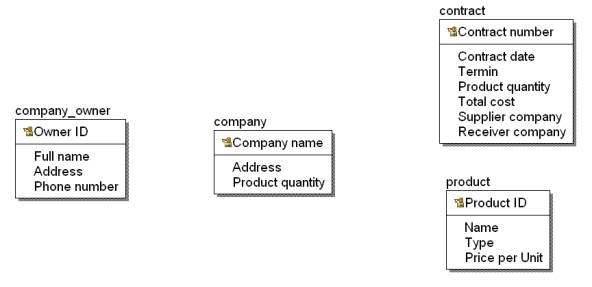
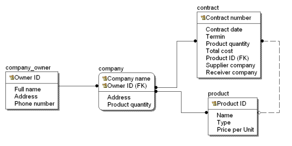
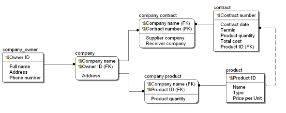
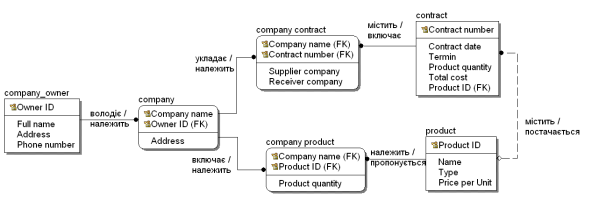
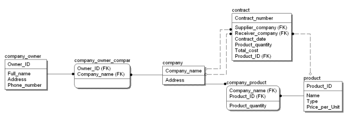

# Практична робота 5
---
Короткий опис
---
Ця робота присвячена проєктуванню бази даних для системи обліку контрактів між компаніями. Вона охоплює розробку моделі, яка враховує всі необхідні дані для опису діяльності компаній на виставці, зокрема інформацію про продукцію, яка представлена для продажу, та контракти між компаніями. Для досягнення цієї мети було виділено ключові сутності — такі як company_owner (власник компанії), company (компанія), product (продукт) і contract (контракт). Модель даних дозволяє систематизувати інформацію про компанії та їхні взаємовідносини в рамках договорів, включаючи деталі постачання, отримувачів та інші важливі параметри. Діаграма "Сутність-зв’язок" (ERD) була створена для наочного відображення структури даних і взаємозв’язків між сутностями, що сприяє ефективності й логічності побудови бази даних.

